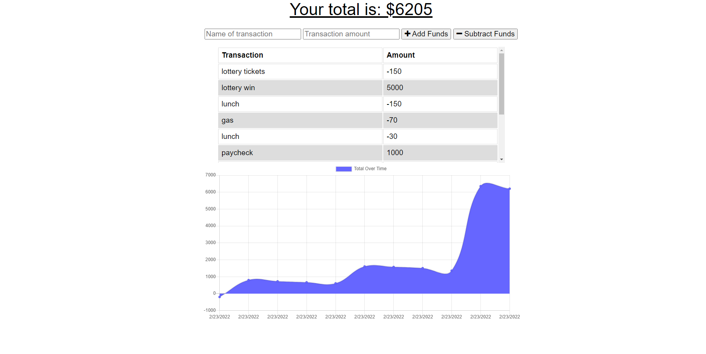

# Budget Tracker

Budget Tracker gives users a fast and easy system to track their budget. This app was built with PWAs to allow offline uses and function.

This app uses `Mongoose`, `IndexDB`, `Service Workers` and `Web Manifest`.

## Table of Contents

- [Installation](#Installation) 
- [Usage](#Usage) 
- [License](#License) 
- [Contributing](#Contributing) 
- [Tests](#Tests) 
- [Questions](#Questions) 

## Installation
This database uses the following npm:
- [Node Package Manager](https://nodejs.org/en/)
  - Run `npm install` in order to install the following npm package dependencies as specified in the `package.json`.
  - This will also help install express on your system and manage any other dependencies in your script.
- [Express](https://www.npmjs.com/package/express)
  - A minimal and flexible Node.js web application framework that provides a robust set of features to develop web and mobile applications. Facilitates the rapid development of Node based Web applications.
- [Mongoose](https://www.npmjs.com/package/mongoose)
  - Mongoose is a MongoDB object modeling tool designed to work in an asynchronous environment. Mongoose supports both promises and callbacks.

This repository uses the following server:

- [Heroku](https://heroku.com/)
  - A cloud application platform service that enables developers to build, run and operate applications entirely in the cloud.
- [MongoDB Atlas](https://www.mongodb.com/atlas/database)
  - Fully-managed cloud database that handles all the complexity of deploying, managing, and healing your deployments on the cloud service provider of your choice (AWS , Azure, and GCP). MongoDB Atlas is the best way to deploy, run, and scale MongoDB in the cloud.

## Usage

Visit [Budger Tracker Heroku](https://sheltered-inlet-39779.herokuapp.com/)

## License
This app is under license from MIT

## Contributing
Read [Installation](#Installation)

## Tests
There are not tests for this app.

## Questions
If you have any questions regarding this project, please contact me at [daveoliverio@gmail.com](mailto:daveoliverio@gmail.com)  
You can view more of my projects at [GitHub](http://github.com/davezer)